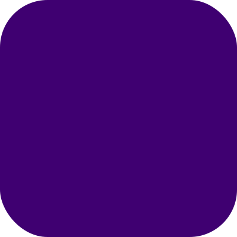

# EchoX: UI = f(DOM, Reactive)



> [!NOTE]
> Work in progress. The APIs are not stable right now.

The lightweight reactive UI framework for declarative DOM manipulation, alternative to React, Vue and jQuery for small projects.

```js
import {html, reactive} from "echox";

const [state, use] = reactive()
  .let("value", 0)
  .derive("double", (d) => d.value * 2)
  .observe((d) => console.log(d.value, d.double))
  .join();

const counter = html.div([
  html.button({onclick: () => state.value++}, ["👍"]),
  html.button({onclick: () => state.value--}, ["👎"]),
  html.span([use("value")]),
]);

document.body.appendChild(counter);
```

## Resources 📚

- Documentation - https://echox.dev/
- Features - https://echox.dev/what-is-echox
- Motivation - https://echox.dev/why-is-echox

## License 📄

MIT@Bairui SU
